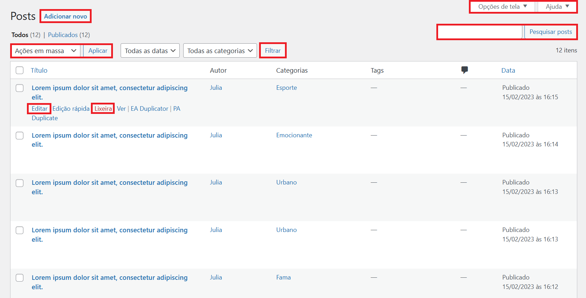

<h1 align=CENTER>TUTORIAL</h1>

███████████████████████████████████████████████████████████████

 

    
Este tutorial tem como objetivo auxiliá-la no uso do painel do WordPress, utilizando algumas ferramentas simples. Abaixo, haverá um menu caso deseje escolher um tópico específico.

 

<h1 align=CENTER>PRINCIPAIS TÓPICOS</h1>

 ║<a href="#login">Login</a> | <a href="#post">Posts</a> | <a href="#midias">Mídias</a> | <a href="#coment">Comentários</a> | <a href="#prod">Produtos/Cursos</a> | <a href="#calend">Calendário</a> | <a href="#perfil">Perfil</a> ║

 

<h1 id="login" align=CENTER>COMO LOGAR E ACESSAR O PAINEL</h1>

███████████████████████████████████████████████████████████

 

Primeiro digite na barra de pesquisa do seu navegador o seguinte:<strong> seudominio/wp-admin.</strong> Exemplo:

 

<strong>Desconsidere o Localhost!</strong>

 

Logo após, essa tela será exibida no seu navegador:

 

<strong>Preencha os campos com o nome de usuário e senha que lhe serão informados. Ao clicar em Acessar você será redirecionada para a tela abaixo.</strong>

 

<h2 id="painel">- Painel</h2>

Este será seu painel administrativo, aonde tudo ocorrerá:

 

<h1 id="post" align=CENTER>POSTS</h1>

███████████████████████████████████████████████████████████

 

<h2 align=CENTER>Subtópicos</h2>

 ║<a href="#insert_p">Inserir Posts</a> | <a href="#categ">Categorias</a> | <a href="#tags">Tags</a> | <a href="#gerenc_p">Gerenciar Posts</a> ║

 

<h2 id="insert_p">- Inserir Posts</h2>

Na barra lateral a esquerda de seu painel passe o mouse pela opção Post e clique em <strong>Adicionar Novo</strong>.

   
   

<ul>
 

<li><strong>Adicionar título</strong>: Essa área é auto-explicativa. Cuidado com o tamanho do título, sugiro que antes de publicar pré-vizualize como vai ficar. Vamos mostrar como fazer isso mais abaixo.</li>
<li><strong>Editar com Elementor</strong>: O botão azul pode ser desconsiderado, pois não será utilizado.</li>
<li><strong>Adicionar o formulário de reservea do Bookly</strong>: Esse botão também deverá ser ignorado.</li>
<li><strong>Adicionar Mídia</strong>: Esse botão serve para incluir: Fotos, vídeos e áudios ao conteúdo do post.</li>
<li>Na última área será inserido o conteúdo de texto do post.</li>

</ul>

<ul>
 

<li><strong>Salvar como rascunho</strong>: Salvará oque foi inserido ou as alterações feitas, porém não irá publicar o post.</li>
<li><strong>Visualizar</strong>: Abrirá uma pré-vizualização de como o post está ficando.</li>
<li><strong>Publicar imediatamente</strong>: Ao clicar em editar você poderá definir uma data para seu post ser publicado, isso será feito automaticamente ao atingir a data definida.</li>
<li><strong>Publicar</strong>: Publicará seu post.</li>
<li><strong>Imagem destacada</strong>: Ao clicar em definir imagem destacada você poderá escolher uma imagem principal para o post no painel abaixo:</li>

</ul>

 

Ao selecionar uma imagem aparecerá algumas informações sobre ela na lateral direita da tela. Você também poderá realizar algumas ações como:

<ul>
 

<li><strong>Excluir permanentemente</strong>: Como o nome já diz, a imagem será excluida das sua biblioteca.</li>
<li><strong>Definir imagem destacada</strong>: Esse é um campo muito importante, então sempre defina uma imagem destacada para seus posts. As dimensões das imagens deve ser de<strong> 540x304</strong>, para que fique padronizado e bonito no layout da página "Blog".</li>
<li>Caso queira adicionar uma nova imagem para a biblioteca é só ir para a opção: <strong>Enviar arquivos</strong>.</li>

 

</ul>

 

 

<ul>
 

<li><strong>Tags</strong>: Escreva uma tag para o seu post e clique em adicionar, você pode adicionar quantas tags desejar. Mas lembre se de separá-las com vírgulas.</li>
<li><strong>Categorias</strong>: Selecione uma categoria já criada ou clique em adicionar nova categoria. Vai abrir uma caixinha onde você poderá criar a nova categoria e adicioná-la.</li>
<i>As tags e categorias ajudam  os seus posts a serem encontrados mais facilmente pelo google, por isso são importantes.</li>

</ul>

 

 

<h2 id="gerenc_p">- Gerenciar Posts</h2>

Na barra lateral a esquerda de seu painel passe o mouse pela opção Post e clique em <strong>Todos os Posts</strong>.

 

Nessa tela terá algumas opções:

<ul>

<li><strong>Adicionar novo</strong>: Redirecionará você para a tela de <a href="#insert_p">Inserir Post</a>.</li>
<li><strong>Ações em massa</strong>: Aplicará uma ação para todos os posts. Ex: Deletar todos.</li>
<li><strong>Filtrar</strong>: Você poderá fazer uma seleção de opções, e depois filtra-las. Ex: Filtrar uma determinada categoria.</li>
<li><strong>Opções de tela e Ajuda</strong>: Estas opções são podem ser ignoradas.</li>
<li><strong>Pesquisar</strong>: Nessa área você poderá pesquisar posts especificos por: tag, categoria, título, etc...</li>
<li>Ao passar o mouse por determinado post aparecerá algumas opções <strong>Utilize apenas as opções: Editar e Lixeira</strong>.<small> Ao pressionar <strongstrong>Editar</strongstrong> ela também irá abrir a opção <strong>Inserir Post</strong> porém com todos os dados salvos e prontos para serem modificados.</small></li>

</ul>

 

<h2 id="categ">- Categorias</h2>

Na barra lateral a esquerda de seu painel passe o mouse pela opção Post e clique em <strong>Categorias</strong>.

<ul>
 

<lili><strong>Nome</strong>: Nome da nova categoria.</li>
<li><strong>Slug</strong>: Repita o nome da categoria todo em minúsculo.</li>
<li><strong>Categoria ascendente</strong>: Cria uma categoria dentro de outra. Ex: A categoria Futebol teria como categoria ascendente a categoria Esporte.</li>
<li><strong>Descrição</strong>: Não é um campo necessário.</li> 
<li>Depois clique em <strong>Adicionar nova categoria</strong> para salvar.</lili>

</ul>

 

<h2 id="tags">- Tags</h2>

Na barra lateral a esquerda de seu painel passe o mouse pela opção Post e clique em <strong>Tags</strong>.

 

 

As tags funcionam semelhantemente as categorias. As mesmas configurações que servem para uma servem para a outra também.

 

<h1 id="midias" align=CENTER>MÍDIAS</h1>

███████████████████████████████████████████████████████████

 

<h2 id="biblio">- Gerenciar Biblioteca</h2>

Na barra lateral a esquerda de seu painel passe o mouse pela opção Mídia e clique em <strong>Biblioteca</strong>.

Nessa área você poderá gerenciar todas as imagens salvas do seu site. Nela é possível:
 

<ul>
 

<li>Pesquisar determinada imagem.</li> 
<li>Adicionar novas imagens.</lki>
<li>Deletar imagens caso queira.</li> 
<strong>CUIDADO PARA NÃO EXCLUIR IMAGENS QUE ESTÃO SENDO USADAS NO LAYOUT DO SITE!</strong>

</ul>

 

<h22 id="nova_img">- Inserir Nova Mídia</h22>

Na barra lateral a esquerda de seu painel passe o mouse pela opção Mídia e clique em <strong>Adicionar Novo</strong>.

 

Para adicionar uma nova mídia, arraste e solte o arquivo no campo ou clique na opção <strong>Selecionar arquivos</strong>.

 

<h1 id="coment" align=CENTER>Comentários</h1>

███████████████████████████████████████████████████████████

Quando houver comentários em algum de seus posts eles apareceram aqui. Nessa tela tem como você gerenciar todos os comentários feitos: Aprovar comentários, defini-lo como spam ou excluí-lo.

<h1 id="prod" align=CENTER> Produtos/Cursos</h1>

███████████████████████████████████████████████████████████

<h2 align=CENTER>Subtópico dos Produtos</h2>

 ║<a href="#novo_prod">Inserir Produto</a> | <a href="#geren_curs">Gerenciamento de cursos</a>║

<h2 id="novo_prod">-  Adicionar novo</h2>

Cadastrar um produto funciona de forma semelhante a <a href="#insert_p">publicar um post</a>.

<ul>

<li><strong>Nome do Produto </strong>: No caso será o título do curso.</li>
<li><strong>Descrição do produoto</strong>: Uma, não muito longa, apresentação de como será o funcionamento do curso.</li>

</ul>

Você só utilizará a aba <strong>Geral</strong> dessa seção. Nela vá em <strong>Produto simples</strong>. Aparecerá algumas opções, selecione <strong>Produto Externo/Afiliado</strong>

Abrirá alguns campos que você deve preencher:

<ul>

<li><strong>URL do produto</strong>: Coloque o link de onde o seu curso esta sendo oferecido para compra.</li>
<li><strong>Texto do botão</strong>: Deixe este campo padronizado para todos os cursos.</li>
<li><strong>Preço</strong>: Coloque o valor que o seu curso está sendo oferecido.</li>
<li><strong>Preço promocional</strong>: Se o curso estiver em promoção na plataforma onde esta sendo vendido edite este campo para que as informações estejam em conformidade.</li>

</ul>

Escreva uma breve descrição sobre o curso. Ela será exibida na barra de pré-vizualização nos cards dos cursos.

Estes campos funcionam igualmente a área de <a href="#pst2">publicar e imagem destacada</a> em inserir post.

Este campo funciona igualmente à área de <a href="#cat3">tags e categorias</a> em inserir post.

<h2  id="geren_curs">- Gerenciar cursos</h2>

Esta área executa as mesmas funções de <a href="#gerenc_p">Gerenciar Posts</a>, porém voltada para os cursos cadastrados. Ignore os botões que estão perto do botão <strong>Adicionar novo</strong>.

<h1 id="calend" align="center">Agendamentos e Calendário</h1>

███████████████████████████████████████████████████████████

<h2 align=CENTER>Subtópico dos Calendário</h2>

 ║<a href="#compro">Compromissos</a>| <a href="#client">Clientes</a>║

Este é o seu calendário de compromissos agendados. Nas setas à esquerda você pode navegar entre os meses. No campo à direita você pode escolher visualizar seus compromissos mensalmente, semanalmente e diariamente ou em formato de lista.

 
 

O dia atual estará destacado no calendário. Para visualizar melhor as informações de cada compromisso, passe o mouse por cima do horário agendado.

Clique no pop-up exibido para abrir uma tela com mais informações sobre o compromisso.

Aqui você pode visualizar as informações do cliente. Clique no símbolo de ✅ para aprovar o agendamento. Não esqueça de selecionar o campo de enviar notificações para o cliente ser notificado da confirmação do agendamento. E ao clicar em guardar você irá salvar todas as alterações.

<h2 id="compro">- Compromissos</h2>

Aqui você pode visualizar melhor todas as informações dos agendamentos. Caso necessário, editar, deletar e adicionar novo compromisso.

<h2 id="client">- Clientes</h2>

Aqui você consegue visualizar os dados pessoais dos clientes, poderá pesquisar determinado cliente, adicionar novo, editar e deletar informações.

 
 
 
 
 
 
<h1 id="perfil" align="center">Perfil</h1>

███████████████████████████████████████████████████████████

Nesta tela, você poderá editar todas as informações do seu perfil, desde as cores exibidas no painel até o seu endereço e definir uma nova senha, entre outras opções.
